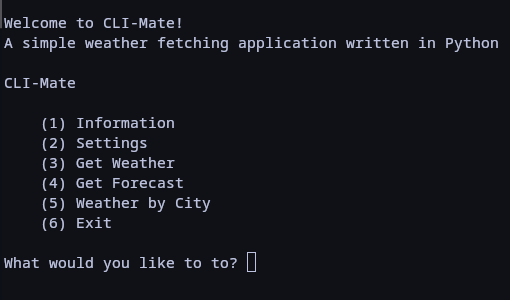
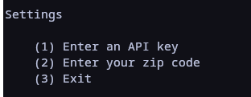
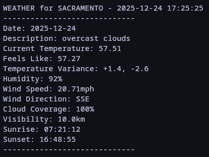
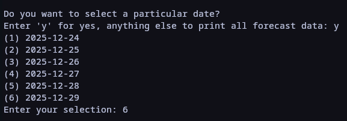
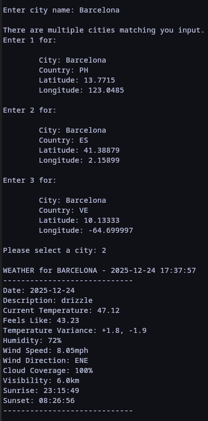

# CLI-Mate   
## A Simple Weather Fetcher Written In Python   
   
## Dependencies   
- Python 3.6+
- Requests
- Key from openweathermap.org

## Installing Dependencies

### Python
If you are using a Linux system there is a good chance that Python in already
installed. If it is not, you can install it via your distributions package 
manager, or from source with a tarball from the official Python [website](https://www.python.org/downloads/source/). To check if python is installed you can run:   
> python --version   

If installing on Windows or Mac you can use the installer found on Python's website
([Windows](https://www.python.org/downloads/windows/), [Mac](https://www.python.org/downloads/macos/))   

### Requests
If installing Requests on a linux system, it may be packaged by your distribution 
and in its official repository for install. If this is the case you can simply 
use your distributions pacakage manager.   

For Linux, Windows, and Mac you may also use Python's official tool for installing
and using python packages, pip. With Python already installed check to see if pip
is installed using:   
> pip --version   

If you get an error then pip needs to be installed. Instructions for installing 
pip for for different operating systems can be found [here](https://pip.pypa.io/en/stable/installation/)   

Once pip is installed you are ready to install Requests. Requests can be installed
by running:   
> python -m pip install requests   

If encountering permission issues on Windows try opening the shell and administrator

### OpenWeather API Key
CLI-Mate uses an OpenWeather API to fetch weather data. A key can be generated 
by simply signing up at (https://home.openweathermap.org/users/sign_up). It is free
and automatically gives you an API key for current weather and 5 day forecasts.
Once the account is created a key should be emailed to you, and can also be found
under the 'API Keys' tab in your profile at openweathermap.org

## Running CLI-Mate
With Python and Requests installed you are ready to use CLI-Mate. Clone the repository 
or download the zip file. If the zip file was downloaded, extract it. Next, in a 
terminal navigate inside the CLI-Mate-main directory. From her run:   
> python3 main.py

Running CLI-Mate for the first time will automatically take you to Settings. Here
you are greeted by a simple menu which allows you to enter your API key or your
zipcode. This information can be changed any time. If nothing is entered you will
receive an error when fetching weather. The wrror will provide suggestions on how 
to fix the problem.

### Get Weather   
CLI-Mate's most simple option is fetching the current weather based on the zipcode
you entered in settings. The weather is updated every 10 minutes.   

### Get Forecast   
CLI-Mate also uses OpenWeather's 5 day, 3 hour forecast to give you up to 40 
different forecasts (the forecast reports weather at 3 hour intervals for 5 24 hour 
periods) based on your zipcode. When selecting this option you will be prompted
to select the desired forecast for a particular day or print all the available 
forecasts.   

### Weather By City   
CLI-Mate has the option to get the current weather anywhere in the world that is 
in OpenWeather's database. When selecting this option you will be prompted to enter 
a city. If the name of the city entered has multiple matches in different countries 
or U.S. states you  will be promted to select the desired city from a list of possible
options.   

### A Note about CLI-Mate's output   
All output is currently in imperial measurments, except for visibility, which is 
only available in metric. 
        
Some output only appears when it is relevant to the weather. For example, rain and
snow will not appear in the output if it is not raining or snowing, or none is predicted. 
        
Temperature Variance is the difference in possible temperatures for the given 
area at the time of the last update. Often when using the 'Get Forecast' option 
temperature variance is not updated which gives the output of +0.0 and -0.0. 
        
Sunrise and Sunset does not appear in the output for the 'Get Forecast'. 

Currently, when searching for weather by city name, the sunrise and sunset time
is given in local time. It is not converted to the time zone where the city is 
located. 

## Images
### Main Menu

### Settings

### Output

### Forecast

### Weather by city

## Bugs
Please report bugs at https://github.com/Alex-Muir/CLI-Mate/issues

